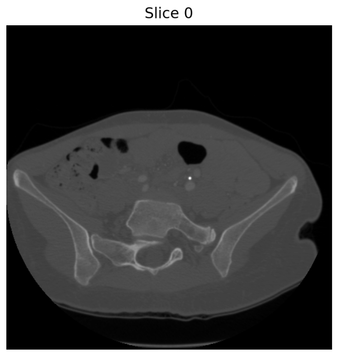
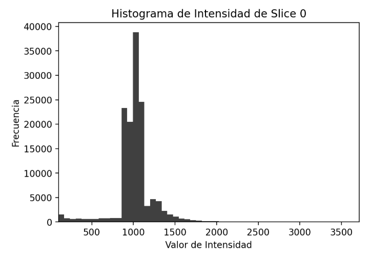
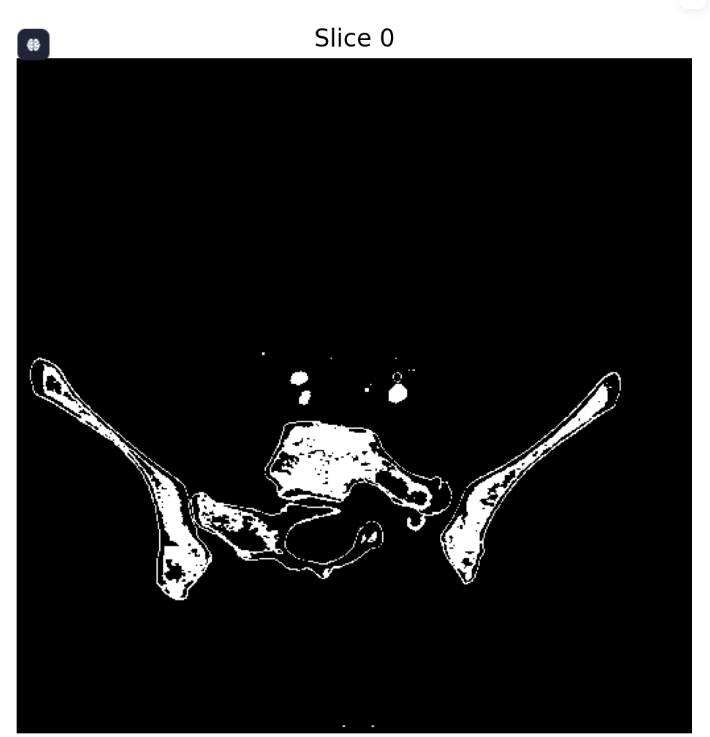
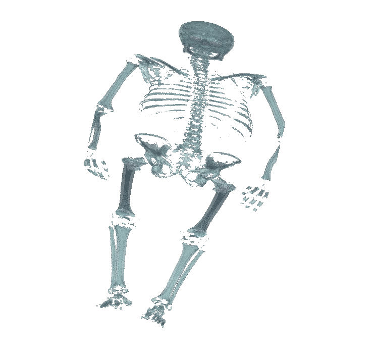

# Visualización y Segmentación de Imágenes DICOM

Este proyecto está diseñado para cargar, procesar y visualizar imágenes médicas en formato DICOM. Permite convertir una serie de cortes en un volumen 3D, segmentar estructuras anatómicas mediante umbrales de Unidades Hounsfield (HU) y visualizar tanto los cortes en 2D como la reconstrucción 3D de las estructuras segmentadas, junto con sus metadatos organizados de forma clara.

Incluye una demostración interactiva desarrollada con Streamlit, que facilita la segmentación y visualización de manera intuitiva. La herramienta es especialmente útil para la exploración de estructuras óseas en estudios de tomografía computarizada (TC).

---
Ejemplos visuales que demuestran el uso de la herramienta interactiva para cargar, segmentar y visualizar imágenes DICOM en 2D y 3D.

### Visualización de cortes

### Histograma

### Segmentación

### Renderizado 3D de Segmentaciones en Archivos DICOM

---
### Requisitos y ejecución

Las librerías necesarias se encuentran especificadas en el archivo `environment.yml`, desde el cual se configura el entorno para ejecutar la herramienta con Streamlit.